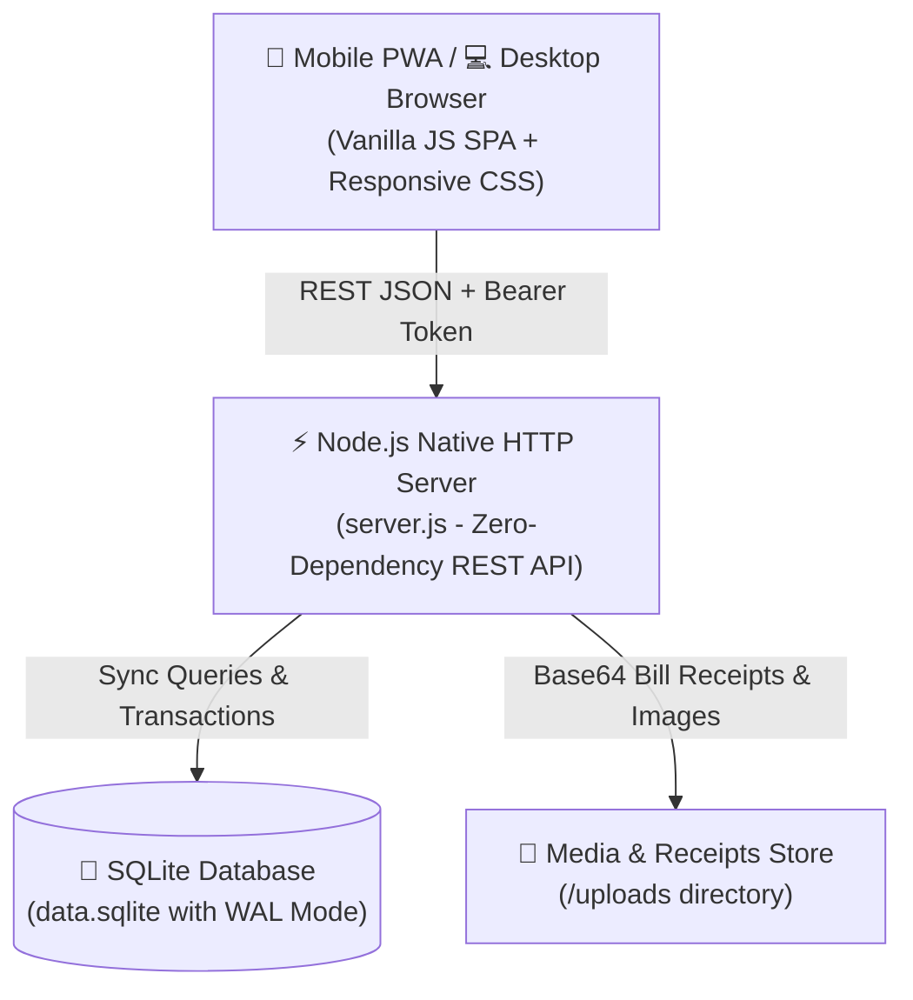
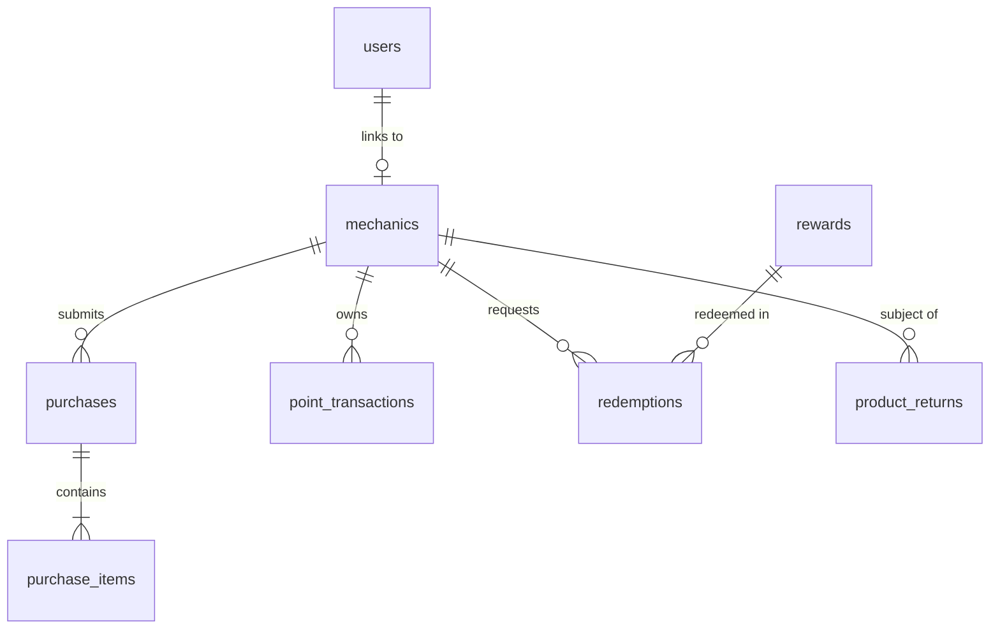

# 🏪 Mahabir Traders - Mechanic Loyalty, Rewards & Field Audit System

[](https://mahaveer-traders.onrender.com)
[](https://github.com/Drat47)
[-f59e0b?style=for-the-badge&logo=sqlite)](file:///d:/Dashboard/database.js)
[](https://mahaveer-traders.onrender.com)

---

## 🌐 Quick Access & Live URLs

* **🚀 Production Live URL:** [https://mahaveer-traders.onrender.com](https://mahaveer-traders.onrender.com)
* **💻 Local Server Access:** `http://localhost:3000`
* **📱 Multi-Device Mobile Access:** `http://<YOUR_LOCAL_IP>:3000` (e.g. `http://192.168.1.X:3000` when on same Wi-Fi)
* **👤 Author / Creator:** **Dharmesh Singhal**

---

## 📖 System Overview

**Mahabir Traders Loyalty & Field Audit System** is an enterprise web application designed for hardware, plumbing, paint, electrical, and construction supply businesses. It automates worker/mechanic loyalty rewards, streamlines field purchase bill submissions with instant photo capture, enables multi-stage auditor verifications, handles product returns with ledger recovery math, and provides a targeted rewards catalog.

### ✨ Key Capabilities:
1. **Multi-Role User Ecosystem:** Distinct interfaces for **Business Administrators**, **Field Verification Auditors**, and **Registered Field Mechanics / Workers**.
2. **Dynamic Trade Categorization:** First-class support for plumbers, painters, tiles mistris, carpenters, raj mistris, electricians, plus custom trade input anywhere.
3. **Bill Logging & Photographic Proof:** High-resolution mobile camera uploads with optional product line items and custom item name fallbacks.
4. **Transparent Points Ledger:** Automated point distribution (e.g., 3 points per ₹100), full ledger audit logs, and automatic point recovery upon customer returns/exchanges.
5. **Dual-Image Rewards Catalog:** Target product promotions (e.g., sell 50 bags of cement to win an induction cooktop) with trade-level audience targeting.
6. **Responsive Dual-Screen UX:** Desktop sidebar layout with wide data tables and mobile-first navigation bar with bottom drawer and PWA 1-tap installation.
7. **Complete Security & Credential Control:** Admin credential updater and admin-controlled mechanic password reset.

---

## 🔑 Default Login Credentials

| Role | Username / Mobile | Password | Access & Privileges |
| :--- | :--- | :--- | :--- |
| **👑 System Administrator** | `admin` | `admin123` | Full access to all modules, settings, approvals, user credentials, reports, ledger adjustments, and rewards catalog management. |
| **🔍 Field Auditor 1** | `audit1` | `audit123` | Bill auditing queue, live camera bill logging, mechanic directory inspection, product returns processing. |
| **🔍 Field Auditor 2** | `audit2` | `audit123` | Field inspection, approval queue, purchase logging. |
| **👷 Demo Mechanic (Worker)** | `MEC1001` *(or `9876510001`)* | `mechanic123` | Worker Dashboard, personal purchase history, reward points balance, points redemption catalog, notifications. |

> **Note:** Administrators can update their own username and password inside **⚙️ Settings**, and can also reset any mechanic's password from the **👷 Mechanics Profile** section.

---

## 🏗️ Technical Architecture & Tech Stack



### 1. Frontend:
* **Architecture:** Ultra-fast Single Page Application (SPA) in [public/js/app.js](file:///d:/Dashboard/public/js/app.js).
* **Styling:** Vanilla CSS design system in [public/css/app.css](file:///d:/Dashboard/public/css/app.css) with CSS custom properties, fluid layouts, dark/light contrast badges, and glassmorphism.
* **PWA Support:** [public/manifest.json](file:///d:/Dashboard/public/manifest.json) and [public/sw.js](file:///d:/Dashboard/public/sw.js) for 1-tap home screen installation on iOS & Android.

### 2. Backend:
* **Runtime:** Node.js (v18+) with native `http`, `crypto`, and `fs` modules in [server.js](file:///d:/Dashboard/server.js).
* **Zero Dependencies Overhead:** High throughput with low memory footprint, optimized for cloud containers like Render.

### 3. Database:
* **Engine:** SQLite using Node.js built-in `node:sqlite` (`DatabaseSync`) in [database.js](file:///d:/Dashboard/database.js).
* **Concurrency:** `PRAGMA journal_mode = WAL;` enabled for concurrent multi-device reads and writes.

---

## 💾 Database Schema & Data Models

The database file is stored locally at `d:/Dashboard/data.sqlite`.



### Main Tables Overview:

1. **`users`**: Login accounts with role-based authentication (`admin`, `auditor`, `mechanic`).
2. **`mechanics`**: Worker registry containing UID, full name, 10-digit phone, trade type, address, `available_points`, `lifetime_points`, and `recovery_points`.
3. **`purchases`**: Bill records with customer details, total amount, status (`PENDING`, `APPROVED`, `REJECTED`, `CORRECTION`), points awarded, and receipt photo URL.
4. **`purchase_items`**: Line items for each bill with catalog product reference or custom item name, quantity, unit, and allocated points.
5. **`rewards`**: Rewards catalog with required points, trade eligibility targeting (`eligible_types`), target item name to sell (`target_product_name`), item photo (`target_product_image_url`), and reward prize photo (`image_url`).
6. **`redemptions`**: Worker claims for catalog rewards with approval workflow.
7. **`product_returns`**: Full reversal records with calculations for customer return value, replacement items, and worker points recovery ledger.
8. **`point_transactions`**: Complete, transparent double-entry points ledger history.
9. **`audit_logs`**: Immutable security log recording user actions, IP addresses, and timestamps.
10. **`settings`**: Key-value application configuration (points calculation rate, business title, permissions).

---

## 🚀 Key Modules & Feature Guide

### 1. 🔐 Authentication & Self-Registration
* **Sign In:** Supports both 10-digit mobile number or alphanumeric User ID (e.g. `9876510001` or `MEC1001`).
* **Self Sign-Up:** Field workers can register their own accounts with full name, mobile number, trade category (with custom specialty input), and password.
* **Auto UID Generation:** Sequential worker IDs (`MEC1001`, `MEC1002`, etc.) generated automatically.

### 2. 🧾 Bill Submission & Field Auditing
* **Snap & Submit:** Upload receipt photos using mobile camera or file selector.
* **Dynamic Product Lines:** Add catalog items from dropdown or type any custom material name directly into the text field.
* **Approval Queue:** Administrators and Auditors review pending bills, inspect receipt images, adjust points, and approve/reject with custom reasons.

### 3. ↩️ Product Returns, Replacements & Auto-Recovery
* **Net Value Recalculation:** When customers return items or exchange products, the net bill difference is calculated automatically.
* **Smart Recovery:** If a worker's available balance is lower than the points to be deducted, remaining points are tracked in `recovery_points` and automatically deducted from future approved bills.

### 4. 🎁 Dual-Image Rewards Catalog
* **Scheme Creation:** Create promotional campaigns displaying:
  * 📦 **Item to Sell:** Name of item + photo of material (e.g. *50 Bags ACC Gold*).
  * 🎁 **Reward Gift:** Name of reward prize + photo of gift (e.g. *Bajaj Mixer Grinder*).
* **Trade Targeting:** Specify which trades can see the reward (or make it visible to all).

### 5. ⚙️ Admin Security & Password Management
* **Admin Credentials:** Update administrator login username, contact number, display name, and password under **⚙️ Settings**.
* **Mechanic Password Reset:** Admins can reset any mechanic's password directly from the **Mechanic Profile** with a dual password confirmation modal.

---

## 📡 REST API Documentation

### Authentication Endpoints
* `POST /api/auth/login` - Authenticate user with username/mobile and password. Returns Bearer token.
* `POST /api/auth/signup` - Register a new mechanic account.
* `GET /api/auth/me` - Get profile and points balance of current user.
* `POST /api/auth/logout` - Invalidate session token.
* `POST /api/admin/change-credentials` - Update admin username, display name, and password.

### Mechanics & Profile Endpoints
* `GET /api/mechanics` - List all mechanics with point balances and trade categories.
* `GET /api/mechanics/:id` - Detailed mechanic overview with transaction history.
* `POST /api/mechanics` - Register a new mechanic (Admin/Auditor).
* `POST /api/mechanics/:id/reset-password` - Admin reset mechanic password.
* `POST /api/mechanics/:id/adjust-points` - Manual ledger credit/debit adjustment.

### Purchases & Bills Endpoints
* `GET /api/purchases` - List purchases (filtered by role).
* `POST /api/purchases` - Submit a new purchase bill.
* `POST /api/purchases/:id/verify` - Approve, reject, or request correction on a bill.
* `POST /api/upload` - Base64 image uploader for receipts and reward photos.

### Returns & Rewards Endpoints
* `GET /api/returns` - List processed return and exchange records.
* `POST /api/returns/process` - Process item return/replacement with points deduction math.
* `GET /api/rewards` - List rewards catalog (filtered by trade for workers).
* `POST /api/rewards` - Create new reward with dual image support (Admin).
* `PATCH /api/rewards/:id` - Update reward scheme details (Admin).
* `DELETE /api/rewards/:id` - Remove reward from catalog.
* `POST /api/redemptions` - Request reward claim (Worker).
* `POST /api/redemptions/:id/decide` - Approve or reject reward claim (Admin).

### Reports & System Endpoints
* `GET /api/dashboard/stats` - Metric summaries, pending counters, and leaderboard.
* `GET /api/audit-logs` - Retrieve security audit log trail.
* `GET /api/audit-logs/export-csv` - Download audit trail as CSV.
* `GET /api/reports/export-purchases-csv` - Download historical purchases as CSV.
* `GET /api/system/network-info` - Local IP addresses and server configuration.

---

## 🛠️ Installation & Local Setup

### Prerequisites
* **Node.js**: v18.0.0 or later installed.
* **Git**: Installed on your system.

### Step 1: Clone Repository
```bash
git clone https://github.com/Drat47/Mahaveer_Traders.git
cd Mahaveer_Traders
```

### Step 2: Install Dependencies
```bash
npm install
```

### Step 3: Run the Server
```bash
node server.js
```
The server will start on port `3000`:
* Desktop / Laptop: `http://localhost:3000`
* Mobile Phones: `http://<YOUR_LOCAL_IP>:3000`

---

## ☁️ Deployment on Render

This application is ready for deployment on [Render](https://render.com).

### Render Build & Start Configuration:
* **Environment:** `Node`
* **Build Command:** `npm install`
* **Start Command:** `node server.js`
* **Live Deployment URL:** [https://mahaveer-traders.onrender.com](https://mahaveer-traders.onrender.com)

---

## 👨‍💻 Author & Maintenance

* **Author:** **Dharmesh Singhal**
* **Repository:** [https://github.com/Drat47/Mahaveer_Traders](https://github.com/Drat47/Mahaveer_Traders)
* **Application:** Mahabir Traders Loyalty & Field Audit System
